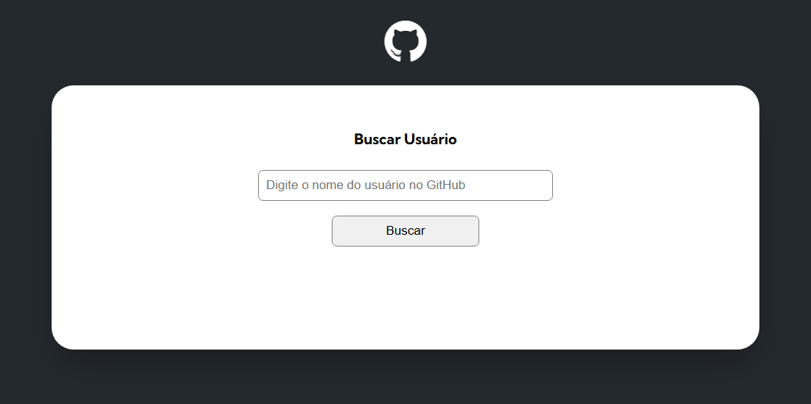
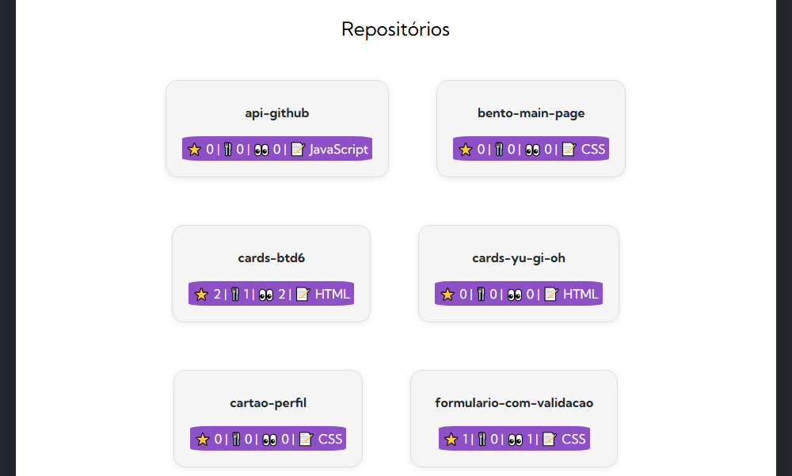

# API GitHub

### Projeto com o objetivo de permitir a busca e visualização de várias informações, através do fetch, da API do GitHub

## Tela inicial

### Após inserir o perfil do GitHub na caixa de busca, a API do GitHub vai retornar esses dados:

## Informações do usuário:

## Repositórios do usuário com algumas informações:

## Últimos eventos do usuário:

### Linguagens Utilizadas:
- HTML5
- CSS3
- JavaScript